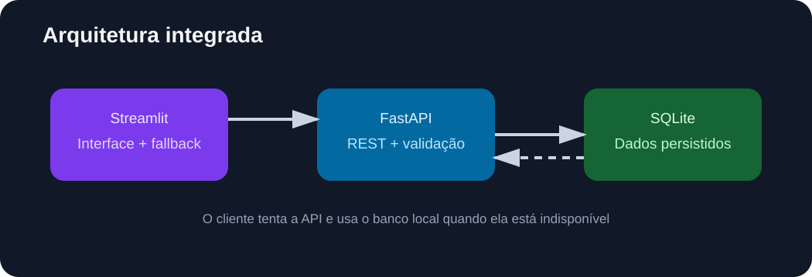

# Projeto 7 — Aplicação integrada de produtos

Projeto de consolidação da trilha: uma aplicação que combina SQLite, FastAPI e Streamlit em um único fluxo. O usuário pode consultar produtos, filtrar por categoria e cadastrar novos registros; a interface tenta consumir a API e usa o banco local como fallback quando a API não está disponível.

## Demonstração

🌐 **Aplicação publicada:** [aplicacao-integrada-produtos](https://aplicacao-integrada-apputos-ewgfqcxnegorwusaclgrew.streamlit.app/)



## O que foi praticado

- persistência local com SQLite;
- API REST com FastAPI e validação Pydantic;
- cliente HTTP configurável por variável de ambiente;
- interface interativa com Streamlit;
- fallback para o banco local em caso de indisponibilidade da API;
- testes de saúde, consulta, filtro e configuração;
- organização de um sistema com camadas separadas.

## Arquitetura

```text
Streamlit (app.py)
       │
       ├── cliente HTTP → FastAPI (api.py)
       │                         │
       └── fallback ───────→ SQLite (integrated_db.py)
```

O endereço da API pode ser alterado pela variável `PRODUCTS_API_URL`. Em ambiente local, a API pode ser iniciada em uma porta separada; no deploy demonstrativo, a interface opera com o fallback SQLite embutido.

## Como executar localmente

```bash
python -m venv .venv
# Windows PowerShell
.venv\Scripts\Activate.ps1
pip install -r requirements.txt
```

Em um terminal, inicie a API:

```bash
uvicorn api:app --reload --port 8503
```

Em outro terminal, inicie a interface:

```bash
$env:PRODUCTS_API_URL = "http://127.0.0.1:8503"
python -m streamlit run app.py
```

Para executar os testes:

```bash
python -m pytest -q
```

## Endpoints da API

| Método | Rota | Finalidade |
|---|---|---|
| GET | `/health` | verifica se a API está disponível |
| GET | `/produtos` | lista produtos |
| GET | `/produtos?categoria=Casa` | filtra por categoria |
| POST | `/produtos` | cadastra um produto validado |

## Estrutura

```text
07-aplicacao-integrada/
├── app.py                 # interface Streamlit
├── api.py                 # API FastAPI
├── client.py              # cliente HTTP
├── integrated_db.py       # persistência SQLite
├── data/products.csv      # dados iniciais didáticos
├── tests/test_integrated.py
└── docs/images/           # diagrama da arquitetura
```

## Limitações e próximos passos

O deploy público da interface usa SQLite local e, por isso, não deve ser tratado como banco persistente de produção. Em uma evolução real, a API seria publicada separadamente e conectada a um banco gerenciado, com autenticação, migrações, logs e observabilidade.

## Contexto acadêmico

Este projeto representa a integração prática dos conteúdos de Python, banco de dados, APIs, testes e visualização estudados na disciplina de Engenharia de Software.
